# Diseño global: backend relacional v2 de ECONOLUZ

**Fecha:** 30/08/2026
**Estado:** aprobado por secciones por el dueño; pendiente de su revisión completa.
**Alcance:** diseño. No autoriza escribir código, crear tablas, ejecutar migraciones ni
tocar producción.

---

## 0. Qué es este documento y qué no

Este documento fija la arquitectura, el modelo de datos, la API y la seguridad del
backend que compartirán la web, el panel y las futuras aplicaciones de iOS y Android.
Es el mapa general.

**No es un plan de implementación.** Cada subproyecto de la sección 11 tiene su propia
especificación y su propio plan, y ninguno empieza sin autorización expresa. La
especificación del primer subproyecto está en
`docs/superpowers/specs/2026-08-30-fundamentos-backend-design.md`.

**Relación con `CLAUDE.md` y `docs/CONTINUAR-PANEL.md`.** Este diseño **no es compatible
con todo lo que dicen hoy esos dos archivos**: una vez aprobado, sustituye reglas vigentes
en materia de existencias —el aviso del carrito, la columna `stock` y el flujo de
disponibilidad— y en materia de la sede de Quetzaltenango. Esos archivos **se actualizarán
por separado, fuera de esta tarea**, y al hacerlo tendrán que distinguir con claridad tres
cosas distintas que hoy se confunden con facilidad:

1. **El comportamiento que existe hoy** y sigue funcionando en producción.
2. **La decisión futura ya aprobada**, que todavía no está implementada.
3. **Lo que no puede retirarse hasta el subproyecto 11**, y solo con autorización expresa.

Mientras esa actualización no ocurra, quien retome el proyecto debe leer este documento
junto a los otros dos, no en lugar de ellos.

**Cuándo se hace, decidido el 30/08/2026:** es una **tarea documental separada, ya
aprobada**, que se ejecuta **después** de cerrar y aprobar estos dos documentos y
**antes** de empezar cualquier implementación.

> **Actualizar la documentación no autoriza a tocar nada de código.** No autoriza a
> retirar `stock`, ni a borrar `app/tienda/disponibilidad.server.ts`, ni a eliminar el
> carrito actual, ni a hacer cambio alguno relacionado con Quetzaltenango. Solo cambia lo
> que dicen los documentos.

`docs/superpowers/plans/2026-08-19-econoluz-hardening.md` sigue siendo un documento
histórico cuyas restricciones no están vigentes.

---

## 1. Auditoría del backend actual

Medido el 30/08/2026 leyendo la base de producción en modo de solo lectura.

### Cifras

| | |
|---|---|
| Tablas | 8 (`leads`, `products`, `admin_users`, `admin_sessions`, `admin_login_attempts`, `projects`, `project_images`, `schema_migrations`) |
| Migraciones aplicadas | 4 (`001`–`004`) |
| Productos | 313, todos publicados |
| Con precio | 25 |
| Con existencias apuntadas | 24 |
| Con `sellable_online` | 0 (columna sin usar) |
| Con ficha técnica en JSON | 313 |
| Tipos / aplicaciones | 7 / 28 |
| Proyectos / fotografías | 12 / 105 |

### Lo que funciona y se conserva

- El migrador repetible con registro en `schema_migrations`.
- La disciplina de centavos enteros en `app/tienda/lineas.ts`.
- La regla de que el navegador solo guarda referencia y cantidad, y el precio se resuelve
  siempre en el servidor.
- La anonimización del proveedor, con una prueba que inspecciona los *chunks* compilados
  (`tests/catalog-production-boundary.spec.ts`). Ese listón se mantiene.
- La autenticación del panel: `scrypt`, sesiones revocables con HMAC-SHA-256, cookie
  `httpOnly` / `sameSite` / `secure` con `path=/admin`, caducidad de doce horas con
  renovación cada quince minutos y límite persistente de intentos.
- `project_images` como patrón de tabla hija con orden y ocultación reversible.

### Los siete problemas que la tienda vuelve intolerables

1. **No existe capa de acceso a datos.** `neon(process.env.DATABASE_URL)` se construye a
   mano en once archivos, cada uno con su `try/catch` y su política de fallo. **No hay
   transacciones en ninguno de los accesos de negocio de la aplicación**, ni tiempos de
   espera, ni errores tipados, ni registro estructurado.

   > Matiz importante, comprobado el 30/08/2026: **el migrador sí es transaccional.**
   > `scripts/migrate.mjs` aplica cada archivo dentro de `begin` / `commit`, hace
   > `rollback` y deshace el archivo entero si una instrucción falla, e inserta la fila
   > de `schema_migrations` **dentro de la misma transacción**. Lo que falta son
   > transacciones en el camino de la aplicación —el que creará pedidos, cobros y
   > facturas—, no en las migraciones.
2. **`products` es una tabla ancha de 28 columnas** que mezcla identidad pública,
   taxonomía, datos del proveedor y comercio. La privacidad del proveedor se garantiza
   proyectando en código (`publicProduct.ts`), no separando datos: la fila entera viaja
   de Neon al proceso y se recorta al final.
3. **El inventario es un número sobrescribible** sin historia. (Ver la sección 3: este
   problema desaparece, porque la empresa no maneja inventario.)
4. **El dinero se guarda como `numeric(10,2)`** y cruza a JavaScript por un `Number()`.
   La regla de centavos enteros solo existe a partir del carrito.
5. **La ficha técnica tiene 58 claves con una cola larguísima**: 30 aparecen en 4
   productos o menos y 15 en uno solo. Normalizarlas todas sería trabajo desperdiciado.
   Existe además una clave `availability` en la base que el contrato público no publica.
6. **La taxonomía vive en el código** (`app/data/catalogTaxonomy.ts`), es plana, de dos
   ejes, sin jerarquía y sin pertenencia múltiple.
7. **No hay API.** Una sola ruta pública (`/api/leads`) más dos internas. Todo lo demás
   son Server Actions y Server Components sin contrato estable ni versionado: hoy no
   existe nada que una aplicación móvil pueda consumir, ni identidad de cliente a la que
   colgar un pedido, una dirección o una factura.

**Deuda de fondo:** `app/data/products.ts` (9.858 líneas) sigue vivo como respaldo, o sea
dos fuentes de verdad conviviendo, y la del código no tiene precios.

---

## 2. Alternativas evaluadas y decisión

Nota de nomenclatura: «Firebase SQL Connect» no existe con ese nombre; el producto es
**Firebase Data Connect** (GraphQL sobre Cloud SQL para PostgreSQL).

| | 1. Firebase Auth + Neon + API propia | 2. Firebase Auth + Firestore | 3. Firebase Data Connect | 4. Autenticación propia en Postgres |
|---|---|---|---|---|
| Relaciones y transacciones | Postgres completo | Sin *joins*; transacciones limitadas | Postgres completo | Postgres completo |
| Lo ya construido | Se conserva entero | Migrar 313 productos y reescribir panel y catálogo | Salir de Neon a Cloud SQL | Se conserva entero |
| Ramas de base de datos para pruebas | Sí | No aplica | No | Sí |
| Correo de verificación y recuperación | Lo envía Firebase | Lo envía Firebase | Lo envía Firebase | **Hay que enviarlo nosotros** |
| Google y Facebook | Incluidos | Incluidos | Incluidos | Implementar OAuth en tres plataformas |
| Soporte sin conexión | Manual | Nativo | Parcial | Manual |
| Coste | Neon escala a cero; Auth con capa gratuita amplia (confirmar la tarifa vigente al configurar) | Se paga por lectura | Cloud SQL encendido 24/7 | El más barato |
| Madurez | Alta | Alta | Producto joven | Alta |
| Reversibilidad | Media-alta | Muy baja | Muy baja | Alta |

**Decisión: opción 1.**

- **Firestore se descarta** porque catálogo, precios, pedidos y facturas son datos
  relacionales de libro, y se perderían *joins*, integridad referencial y contabilidad
  limpia a cambio de un soporte sin conexión que este negocio apenas necesita.
- **Data Connect se descarta** aunque resuelva el cliente móvil tipado: saca el proyecto
  de Neon y con ello de las ramas de base de datos, que son la estrategia de pruebas
  aisladas que este mismo diseño exige. Además no elimina el backend propio, porque el
  pago y el FEL necesitan servidor igualmente.
- **La autenticación propia se descarta por un motivo concreto de este proyecto**, no
  teórico: el correo transaccional está bloqueado. El dominio corporativo lo controla un
  tercero, Resend no puede verificar el remitente —por eso el aviso de leads sigue
  apagado— y una autenticación propia exige enviar verificación y recuperación de
  contraseña. Firebase los envía desde su propio dominio.

**Dos matices que forman parte de la decisión:**

1. **El panel de administración conserva su autenticación actual.** No se migran los
   administradores a Firebase: funciona, está cubierto por 129 pruebas y cambiarlo es
   trabajo sin beneficio. Firebase entra solo para clientes.
2. **Se arranca con correo y Google; Facebook después.** El acceso con Facebook exige una
   aplicación de Meta con verificación de empresa, un trámite que no debe bloquear la
   tienda.

**App Check** se adopta como capa adicional y queda escrito que **no es una frontera de
seguridad**: en web necesita reCAPTCHA Enterprise y es evadible. La frontera es el token
verificado en el servidor.

---

## 3. Decisiones tomadas

| # | Decisión | Resuelto | Reversibilidad |
|---|---|---|---|
| 1 | Firebase Auth (clientes) + Neon + API propia; panel intacto | 30/08/2026 | Media-alta: `firebase_uid` es una columna, no la clave primaria |
| 2 | Navegar y llenar el carrito sin cuenta; cuenta obligatoria antes de pagar | 30/08/2026 | Alta: `orders.user_id` admite nulo |
| 3 | **La empresa no maneja inventario**: cada producto se le pide al proveedor | 30/08/2026 | No aplica: es un hecho del negocio |
| 4 | Se cobra al comprar, con plazo estimado; si el proveedor no puede servir, se cancela y se reembolsa | 30/08/2026 | Alta: el modelo admite autorizar y cobrar por separado |
| 5 | Solo envío por mensajería a todo el país; sin recogida ni reparto propio | 30/08/2026 | Alta: la recogida sería un método de envío más |
| 6 | NIT y nombre fiscal, con consumidor final como opción | 30/08/2026 | Alta |
| 7 | Árbol de categorías padre/hijo con pertenencia múltiple; el ambiente es característica filtrable, no categoría | 30/08/2026 | Media: reclasificar cuesta trabajo manual |
| 8 | Se normalizan 12 características más el ambiente; el resto sigue en JSON | 30/08/2026 | Alta: añadir una más es una fila en `attributes` |
| 9 | Dos roles de panel: administrador y empleado | 30/08/2026 | Alta: un tercer rol es una línea de migración |
| 10 | Borrado real de cuenta con anonimización; pedidos y facturas se conservan | 30/08/2026 | Baja: es requisito de Apple y Google |
| 11 | Precio vigente más promoción opcional con fechas, en centavos enteros | 30/08/2026 | Alta |

### Consecuencia mayor de la decisión 3

**Desaparece un subproyecto entero.** No hay `warehouses`, ni `inventory_levels`, ni
`inventory_movements`, ni `stock_reservations`, ni descuento de unidades, ni reservas
temporales, ni prueba de concurrencia sobre la última unidad. El riesgo no desaparece:
se transforma en riesgo de plazo y de devolución del dinero, y se modela con el estado
«confirmado con el proveedor», la cancelación y el reembolso.

Queda pendiente, para el subproyecto 11 y **solo con autorización expresa**, retirar la
columna `products.stock`, `app/tienda/disponibilidad.server.ts`, el aviso del carrito con
«Dejar solo N» y «Quiero N y espero», sus pruebas y las reglas de `CLAUDE.md` que lo
describen. **`stock` no debe reaparecer en la API nueva bajo ninguna forma.**

---

## 4. Arquitectura

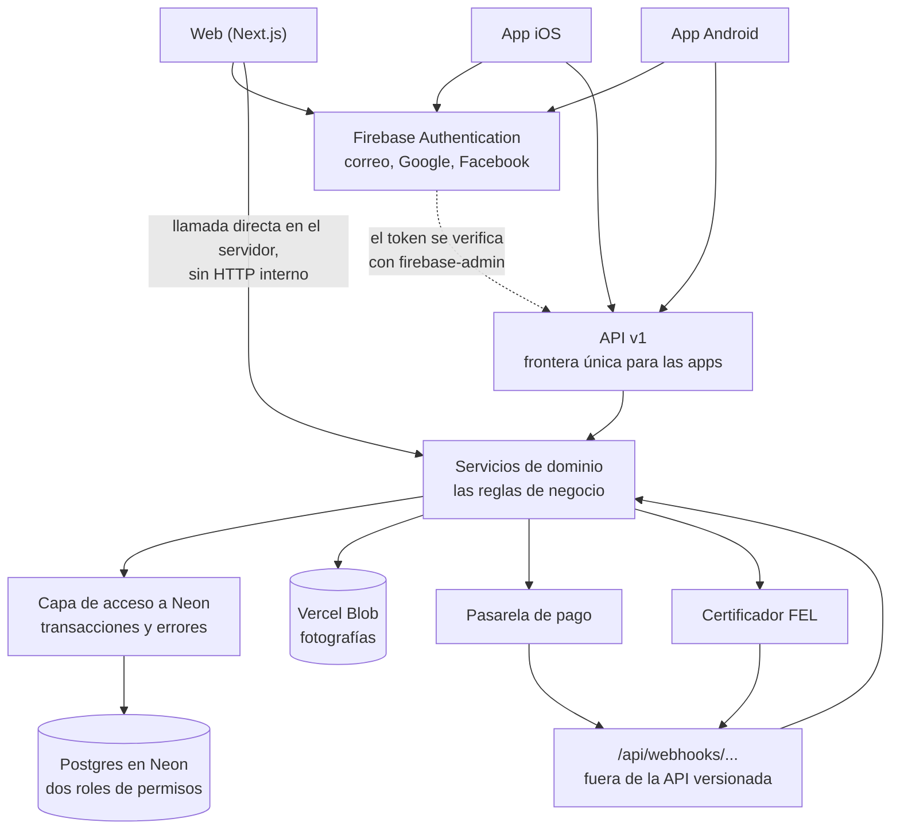

La regla de fondo: **las reglas de negocio viven en los servicios, no en el transporte.**
Un pedido se crea igual desde un Server Component que desde una petición HTTP de la app
de iOS. Eso es lo que impide que la web y las apps acaben comportándose distinto.

---

## 5. Modelo de datos

**33 tablas nuevas en total**, más las 8 existentes. El desglose importa porque las tres
categorías tienen naturalezas distintas:

| Categoría | Cuántas | Cuáles |
|---|---|---|
| Negocio y contenido | 31 | Las de los ocho dominios de esta sección |
| Configuración | 1 | `app_settings` (sección 9.4), que no pertenece a ningún dominio y nace en el subproyecto 1 |
| Proyección derivada | 1 | `public_products` (sección 7.2): **no es fuente de verdad**. Es una *tabla de proyección pública derivada y sincronizada* que contiene el catálogo ya saneado |

Ningún subproyecto crea más de nueve tablas: cada uno trae solo las suyas.

### 5.1 Reglas transversales

- **Todo importe se guarda en centavos enteros** (`*_cents integer`), nunca `numeric` ni
  coma flotante. El precio actual `numeric(10,2)` se convierte durante la migración.
- **El IVA guatemalteco del 12 % está incluido en el precio mostrado.** `tax_cents` es el
  IVA *contenido* en el total, calculado, no una cantidad que se suma encima.
- **Nada que llegue del navegador se usa como importe.** Precios, totales, impuestos,
  descuentos y tarifas de envío se recalculan siempre en el servidor a partir de
  `product_prices` y `shipping_rates`.
- **Las direcciones IP no se guardan en claro**, solo su huella.
- Toda tabla lleva `created_at`, y `updated_at` donde se edite, mantenido por disparador
  como ya hace `products`.

### 5.2 Identidad y clientes — 4 tablas

`users` · `user_addresses` · `user_consents` · `auth_events`

- `users`: `firebase_uid` único, correo normalizado, nombre, teléfono, NIT y nombre
  fiscal por defecto, estado, y fechas de anonimización.
- `user_addresses`: destinatario, teléfono, departamento, municipio, dirección,
  referencias de ubicación (imprescindibles en Guatemala), y marca de predeterminada.
- `user_consents`: tipo (términos, privacidad, comunicaciones), versión aceptada, fecha
  y revocación.
- `auth_events`: registro, acceso, vinculación de proveedor y borrado, con huella de IP.

**Tres apartamientos deliberados de la lista original del encargo:**

1. **No hay `roles` ni `user_roles`.** Los roles decididos —administrador y empleado— son
   del panel, no de los clientes: todo cliente es cliente. Se implementan como una
   columna `role` en `admin_users` con restricción de valores. Dos tablas para dos
   valores es infraestructura sin uso, y añadir un tercer rol es una línea de migración.
2. **El NIT vive en `users` y se copia al pedido.** No hay tabla de perfiles fiscales;
   quien factura unas veces a su nombre y otras a su empresa lo edita en el checkout, y
   el pedido guarda su copia.
3. **`auth_events` no guarda IP en claro.**

### 5.3 Catálogo — 9 tablas

`categories` · `product_categories` · `product_private_data` · `product_images` ·
`attributes` · `attribute_options` · `category_attributes` · `product_attribute_values` ·
`product_prices`

- `categories` tiene `parent_id` hacia sí misma, `slug` único, posición y publicación.
- `product_categories` permite pertenencia múltiple con **una categoría marcada como
  principal** (índice único parcial).
- **`products` adelgaza de 28 columnas a unas 10.** Las imágenes salen a
  `product_images` copiando el patrón probado de `project_images`; las siete columnas
  `supplier_*` salen a `product_private_data`; el precio sale a `product_prices`.
- `attributes` declara el tipo de dato (`numero`, `texto`, `booleano`, `opcion`,
  `opcion_multiple`), la unidad, y si sirve para filtrar o comparar.
- `product_attribute_values` guarda `value_number`, `value_text`, `value_bool` y
  `option_id`, **con una restricción que obliga a llenar exactamente la columna que
  corresponde al tipo declarado**. Eso es lo que permite filtrar «entre 15 y 25 W» en
  lugar de buscar la cadena «20 W». Índices por `(attribute_id, value_number)` y
  `(attribute_id, option_id)`.
- `product_prices` guarda centavos enteros, tipo (`normal`, `promocion`) y periodo de
  validez, con **restricción de exclusión que impide dos promociones solapadas** para el
  mismo producto. La base rechaza el error; no depende de que la aplicación se acuerde.
- La ficha descriptiva —las 46 claves restantes, `specialFeatures` incluida— sigue en
  `products.technical_specs` como JSON.

**Las 12 características que se normalizan**, con el número de productos que ya la tienen:
`protection` (IP, 217), `voltage` (210), `power` (190), `colorTemperature` (174),
`beamAngle` (161), `material` (150), `cri` (141), `efficiency` (137), `luminousFlux`
(119), `dimming` (101), `installation` (84), `finish` (82). Más **`ambiente`**, que no
existe hoy y se sembrará automáticamente a partir de la aplicación actual para revisión
manual posterior.

### 5.4 Carrito — 2 tablas

`carts` · `cart_items`

**El carrito anónimo sigue viviendo en el navegador**, como hoy; en la base solo existe
el del usuario con sesión. Guardar carritos anónimos acumularía basura de cada visitante.
Al iniciar sesión el navegador envía sus líneas y el servidor las fusiona sumando
cantidades, con el tope de 999 por línea ya vigente.

### 5.5 Pedidos — 5 tablas

`orders` · `order_items` · `order_addresses` · `order_status_history` ·
`idempotency_keys`

- `orders` guarda número público, estado, importes en centavos, datos fiscales copiados
  (NIT, nombre fiscal, consumidor final), plazo estimado y fecha de confirmación con el
  proveedor.
- **`order_items` guarda su propia instantánea** de referencia, nombre, precio unitario,
  cantidad e impuesto. La clave hacia `products` es opcional, para que retirar un
  producto no rompa un pedido histórico.
- `order_addresses` guarda copia completa de la dirección de envío y la de facturación.
- `idempotency_keys` impide que un doble clic o un reintento cree dos pedidos.

### 5.6 Pagos, FEL y envíos — 9 tablas

`payments` · `payment_events` · `refunds` · `invoices` · `invoice_events` ·
`shipping_zones` · `shipping_rates` · `shipments` · `shipment_events`

- **Ningún dato de tarjeta toca la base.** Solo el identificador que devuelve la pasarela.
- **`payment_events` e `invoice_events` son además la cola duradera de webhooks**, no un
  simple registro histórico. Cada fila guarda: proveedor, identificador único del evento,
  tipo de evento, cuerpo necesario o referencia segura, fecha de recepción, estado
  (`pending`, `processed`, `failed`), número de intentos, último error y próxima fecha de
  reintento. Llevan **restricción única `(provider, provider_event_id)`**, que es lo que
  descarta las repeticiones. La fila se escribe **antes** de responder al proveedor
  (sección 6.3).
- **Ni la pasarela ni el certificador se nombran en el modelo**: ambas llevan columna
  `provider`, así que todo se puede construir ahora y contratar después.
- Las zonas de envío se definen por departamento, con tarifa fija por zona y umbral
  opcional de envío gratis. La tarifa por peso se descarta: las luminarias son
  voluminosas y ligeras, y la tarifa por peso siempre sale mal.

### 5.7 Contenido y administración — 2 tablas nuevas

`lead_items` · `audit_log`

`leads` gana líneas y estado, para dejar de ser una tabla plana con los productos metidos
en un JSON de texto. `projects` y `project_images` no se tocan. `audit_log` registra
quién cambió qué, con el antes y el después.

### 5.8 Relaciones principales

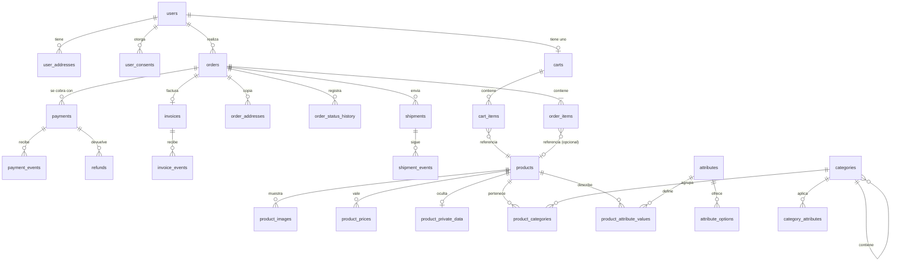

`product_private_data` aparece en el diagrama porque existe, pero **el rol de lectura
pública no puede leerla ni a ella ni a ninguna tabla base sensible** (sección 7).

---

## 6. Capa de acceso a datos y API

### 6.1 La capa de acceso

Los once puntos de acceso actuales se sustituyen por una única frontera en
`app/lib/datos/`, con dos formas de hablar con la base. La distinción no es estilística
sino una limitación real del controlador:

- **Lecturas por HTTP** con `neon()`: una ida y vuelta por consulta, barato, escala a
  cero. Catálogo, categorías y fichas.
- **Escrituras dentro de transacción** con la conexión agrupada sobre WebSocket. El
  controlador HTTP **no puede** hacer transacciones interactivas —leer, decidir y
  escribir según lo leído—, que es exactamente lo que exige crear un pedido con sus
  líneas, su dirección y su registro de estado como una sola operación.

**Requisitos de las transacciones interactivas:**

- La ruta o acción declara `export const runtime = "nodejs"`.
- Se usa la conexión agrupada, no el controlador HTTP.
- `BEGIN`, `COMMIT`, y `ROLLBACK` ante cualquier error.
- Tiempo máximo explícito.
- **El cliente se libera siempre en un `finally`**, haya error o no.
- **No se abre ni se cierra el pool completo en cada transacción**: el pool se conserva y
  reutiliza conexiones inactivas.

La capa expone además errores tipados que distinguen «no encontrado», «conflicto»,
«permiso denegado» e «indisponible» —distinción que hoy solo existe en el panel—, y
registro estructurado con `request_id`.

**Regla estructural, con su alcance exacto:** dentro de `app/**`, ningún archivo fuera de
`app/lib/datos/` importa `@neondatabase/serverless`, y una prueba lo comprueba. Sin esa
prueba, en tres meses habrá un archivo número doce.

**La regla no alcanza a `scripts/**`, y no puede alcanzarlo.** `scripts/migrate.mjs` tiene
que conectarse por sí mismo: crea el esquema del que depende la capa, se ejecuta fuera de
la aplicación y no puede darlo por existente. Lo mismo vale para los scripts de
importación y verificación. Los scripts mantienen su propia frontera —un ayudante común en
`scripts/` cuando compartan conexión— y quedan explícitamente excluidos de la
comprobación automática, en lugar de dejar una regla que el propio migrador incumpliría
desde el primer día.

### 6.2 La API v1

- **Contrato estable:** toda respuesta correcta es `{ data, meta }`; todo error es
  `{ error: { code, message, details }, request_id }`, con códigos legibles por máquina
  que no cambian aunque cambie el texto.
- **`details` solo transporta información segura y elegida a mano** —qué campo del
  formulario falló y por qué—. **Nunca** mensajes de SQL, nombres internos de tablas,
  trazas de pila, secretos ni nada del proveedor. El error completo vive en el registro
  del servidor y el `request_id` es lo que une la queja del cliente con esa línea.
- **Paginación por cursor**, no por número de página: con un catálogo que se reordena, la
  página 3 no significa nada estable.
- **Idempotencia** por cabecera `Idempotency-Key` en las peticiones **nuestras** que
  crean cosas: pedidos, intentos de pago y facturas.
- **Versionado con salida para apps viejas:** `/api/v1` solo admite cambios que añaden.
  Un cambio incompatible crea `/api/v2` y ambos conviven. Un punto de la API publica la
  versión mínima soportada, para que una aplicación antigua pueda pedir al usuario que
  actualice en vez de fallar de forma incomprensible.
- **Límite de peticiones** solo donde hace falta —acceso, checkout, formularios—, no en
  la lectura del catálogo, reutilizando el patrón ya probado de `admin_login_attempts` y
  detrás de una interfaz que permita cambiar de almacén.

**Superficie inicial:** catálogo, ficha, categorías y filtros; carrito y su fusión;
perfil, direcciones y borrado de cuenta; pedidos; asesoría.

### 6.3 Los webhooks van fuera de la API versionada

`/api/webhooks/pagos/<proveedor>` y `/api/webhooks/fel/<proveedor>`. **No usan Firebase
Auth ni sesión.** Su contrato lo fija el proveedor externo, no nosotros, y por eso no
comparte el ciclo de vida de `/api/v1`.

Cada webhook:

1. Lee el **cuerpo original en crudo** como texto antes de interpretarlo como JSON;
   volver a serializar cambia los bytes e invalida la firma.
2. Verifica la firma del proveedor sobre esos bytes.
3. **Antes de responder 2xx**, guarda el evento de forma duradera: proveedor,
   identificador único del evento, tipo, cuerpo necesario o referencia segura, fecha de
   recepción, estado `pending`, número de intentos, último error y próxima fecha de
   reintento. La restricción única `(provider, provider_event_id)` descarta los
   duplicados.
4. Solo entonces responde al proveedor.
5. El procesamiento diferido lo hace un mecanismo **duradero de reintentos**. Nunca un
   `Promise` sin esperar dentro de una función serverless: puede quedarse a medias en
   cuanto la función devuelve la respuesta, y el cobro se perdería sin que nadie se
   entere.

**La regla que lo sostiene todo:** ninguna confirmación del navegador convierte un pedido
en pagado. Solo lo hace un webhook firmado.

---

## 7. Seguridad

### 7.1 Qué es secreto y qué no

La **configuración web de Firebase es pública por diseño** —clave de API, dominio,
identificador de proyecto— y puede viajar al navegador.

Son secretos de servidor, en variables de entorno de Vercel y nunca en el repositorio:
`DATABASE_URL`, `DATABASE_URL_PUBLIC`, `ADMIN_SESSION_SECRET`, `BLOB_READ_WRITE_TOKEN`,
las claves de la pasarela y del certificador, y la **cuenta de servicio de Firebase**.

**La cuenta de servicio de Firebase** será exclusiva de ECONOLUZ, con los privilegios
mínimos necesarios, almacenada únicamente como secreto de servidor, **nunca impresa en
registros ni en mensajes de error**, y con procedimiento de rotación documentado.

### 7.2 Los dos roles de PostgreSQL

El rol de lectura pública **no recibe `SELECT` sobre ninguna tabla base sensible**, y en
particular **no lo recibe sobre `products`**. Lee exclusivamente proyecciones públicas que
ya excluyen por construcción:

- las filas no publicadas o no vigentes;
- los datos del proveedor;
- la información administrativa;
- cualquier columna que no forme parte del contrato público.

Para el catálogo, esa proyección es la tabla de proyección pública derivada y sincronizada
`public_products` (sección
7.2.1). Para categorías, atributos, opciones, imágenes y precios bastan vistas, **con una
condición explícita**: sus nombres y etiquetas deben escribirse ya en su forma pública
desde el panel, sin marcas, series ni códigos del proveedor. No es una suposición
gratuita, es una regla que hay que vigilar: hoy la aplicación `magnetrack_pro` es
precisamente taxonomía con nombre de proveedor dentro, y por eso `publicProductPrivacy.ts`
la traduce al salir. En el modelo nuevo esa traducción se hace **al escribir**, la
taxonomía nace pública, y `npm run catalogo:auditar` se amplía para comprobarlo. Si alguna
vez hiciera falta sanear texto en alguna de esas entidades, esa entidad pasaría también a
proyección derivada.

Tiene **denegado** el acceso a `products`, `product_private_data`, `users`, `user_addresses`,
`orders`, `order_items`, `payments`, `invoices`, `leads`, `admin_sessions`, `audit_log` y
a cualquier tabla base equivalente.

**Credenciales:** las migraciones pueden definir el rol, revocar permisos y conceder
`SELECT` sobre la proyección pública y las vistas, pero **ninguna contraseña del rol puede aparecer en una
migración ni en el repositorio**. Se generan y rotan fuera, y se guardan como secreto en
Neon y en Vercel. El procedimiento se documenta aparte (creación del rol con capacidad de
acceso, generación y rotación de la contraseña, obtención de `DATABASE_URL_PUBLIC`,
configuración en desarrollo, pruebas, staging y producción, y verificación de que la
cadena usa realmente el rol público).

**Comportamiento si falta `DATABASE_URL_PUBLIC`:**

| Entorno | Comportamiento |
|---|---|
| Desarrollo local | Se permite `DATABASE_URL` con aviso explícito en consola |
| Pruebas | Deben proporcionarse las dos conexiones; no se admite degradación |
| Producción | **Se usa el catálogo estático actual como respaldo seguro** y se registra un error de configuración. **Nunca** se usa la conexión privilegiada para la lectura pública |

La razón es que usar la conexión privilegiada como respaldo convertiría un fallo de
configuración en la desaparición silenciosa de la protección que este diseño construye.

#### 7.2.1 Por qué el catálogo necesita una proyección derivada, y no una vista

> **Nomenclatura, para que no haya equívoco.** `public_products` es una **tabla de
> proyección pública derivada y sincronizada**: una tabla ordinaria de PostgreSQL que la
> aplicación mantiene al día. **No es una `MATERIALIZED VIEW` de PostgreSQL** —no se
> refresca con `REFRESH MATERIALIZED VIEW` ni depende del planificador— y **no es fuente
> de verdad**: su contenido se puede reconstruir entero, en cualquier momento, a partir de
> `products`. Si se borrara, no se perdería ningún dato.

**Excluir las columnas `supplier_*` no reproduce la protección actual.** Comprobado en el
código el 30/08/2026: `app/data/publicProduct.ts` y `app/data/publicProductPrivacy.ts`
hacen cinco cosas más que ocultar columnas.

1. Limpian nombres y códigos del proveedor que aparecen **dentro de los textos**.
2. Filtran la ficha técnica a las claves permitidas (`PUBLIC_TECHNICAL_SPEC_KEYS`).
3. Sustituyen denominaciones privadas —`Magnetrack Pro` pasa a «microrriel magnético de
   48 V»—, incluido el identificador de aplicación que usan los filtros.
4. Transforman las rutas de imagen a `arquitectonico/`, `lineal/` y `electrico/`.
5. Generan el identificador público a partir de la referencia.

Y lo decisivo: **parte de esa limpieza usa los datos privados como contexto.**
`sanitizePublicSupplierText` construye sus patrones de búsqueda a partir de
`supplierBrand`, `labels.brand`, `labels.series`, `series`, `supplierCode` y `name` del
propio producto. Una vista que no devuelva esos campos **no puede** ejecutar esa limpieza,
y un rol que sí los viera dejaría de estar aislado. La vista pura es imposible: o no
sanea, o no aísla.

**Solución: la limpieza se adelanta de la lectura a la escritura.**

- `public_products` es una **tabla de proyección pública derivada y sincronizada** que
  contiene el contrato público ya saneado: identificador público, referencia, nombre y
  descripción limpios, ruta de imagen pública, galería pública, taxonomía pública con sus
  etiquetas, ficha técnica filtrada y saneada, y el precio vigente.
- La escribe **el camino privilegiado** —el panel al guardar un producto, y un comando de
  reconstrucción completa—, ejecutando **exactamente el mismo código que hoy**:
  `toPublicProduct` junto a `publicProductPrivacy`. **La lógica de privacidad no se
  reescribe**; solo cambia el momento en que se ejecuta.
- El rol público recibe `SELECT` únicamente sobre esa tabla. No puede ver un texto sin
  sanear porque en su lado de la frontera no existe ninguno.

**Cómo se demuestra que la salida pública no cambia**, sin lo cual no se activa nada:

- **Paridad de los 313:** la proyección de cada producto debe ser idéntica, campo por
  campo, al resultado de computar hoy `toPublicProduct` sobre el producto interno.
- **Privacidad:** `npm run catalogo:auditar` sobre la proyección debe seguir devolviendo
  **0 coincidencias** sobre los 408 identificadores normalizados; `npm run
  test:proveedores` y `tests/catalog-production-boundary.spec.ts` se conservan y se
  ejecutan además contra el camino nuevo.

**Cómo se despliega, decidido y aprobado por el dueño el 30/08/2026:**

- **En el subproyecto 1 la proyección se construye y se prueba, pero es una proyección
  derivada de prueba: no sustituye todavía al catálogo que ve el visitante.** Existe
  porque el rol público necesita una superficie segura que leer; no porque haga falta
  cambiar lo que se sirve.
- **`publicProduct.ts` y `publicProductPrivacy.ts` permanecen activos e intactos** hasta
  demostrar la paridad y la privacidad completas de los 313 productos. Siguen siendo el
  camino de producción.
- **La bandera se queda en `legacy` al terminar el subproyecto 1.** `shadow` se usa
  únicamente para comparar resultados y registrar diferencias, sin cambiar lo que ve
  nadie.
- **`relational_v2` solo podrá activarse en el subproyecto 3**, cuando exista de verdad el
  catálogo relacional y todas las pruebas de paridad y privacidad estén en verde. **Su
  activación requiere autorización expresa del dueño.**

**Riesgo propio de la proyección:** puede desincronizarse y mostrar datos viejos. Se
mitiga escribiéndola dentro de la misma operación que guarda el producto —el mismo punto
donde el panel ya invalida la caché del catálogo—, con un comando de reconstrucción total
idempotente y una comprobación que detecte filas desincronizadas.

### 7.3 Identidad

- **Los tokens de Firebase se verifican con `firebase-admin`**, la implementación
  oficial. El proyecto también necesita de ese SDK la gestión de usuarios, las cuentas
  desactivadas, la revocación de sesiones y los proveedores vinculados, así que la
  dependencia entra justificada por el conjunto y no solo por la verificación. No se
  sustituye por una verificación manual salvo que se demuestre con una prueba concreta
  que causa un problema real en este proyecto.
- **Correo verificado antes de pagar.** Navegar y llenar el carrito no lo exige;
  completar el pedido sí. La razón es práctica: la factura FEL se envía por correo, y un
  correo inventado significa una factura emitida que no llega a nadie.
- **Cuentas desactivadas y sesiones revocadas se comprueban en cada verificación**, no
  solo al iniciar sesión.
- **La web usa una cookie de sesión `httpOnly` emitida por el servidor** a partir del
  token de Firebase, para que los componentes de servidor sepan quién es quien sin
  exponer el token al JavaScript de la página. Con `sameSite`, `secure` y protección CSRF
  en las operaciones que mutan.
- **App Check** como capa adicional, nunca como sustituto de la autenticación.

### 7.4 Datos personales y borrado de cuenta

El borrado de cuenta **no borra la contabilidad**. Se revoca y elimina la identidad en
Firebase; se borran perfil, direcciones, teléfono y consentimientos en Neon; y se
conservan pedidos, pagos y facturas con el cliente desligado y únicamente los datos
comerciales o fiscales que la factura ya contiene y la ley obliga a guardar.

**La política exacta —qué se conserva, cuánto tiempo, qué se anonimiza y con qué
periodo— se decidirá antes de implementar el subproyecto de identidad**, no en este
documento.

Se implementa desde el primer día porque **Apple y Google exigen que toda aplicación que
permita crear una cuenta permita borrarla desde dentro de la propia aplicación**. No es
una preferencia: es requisito de publicación.

---

## 8. Flujos

### 8.1 Registro con correo, Google y Facebook

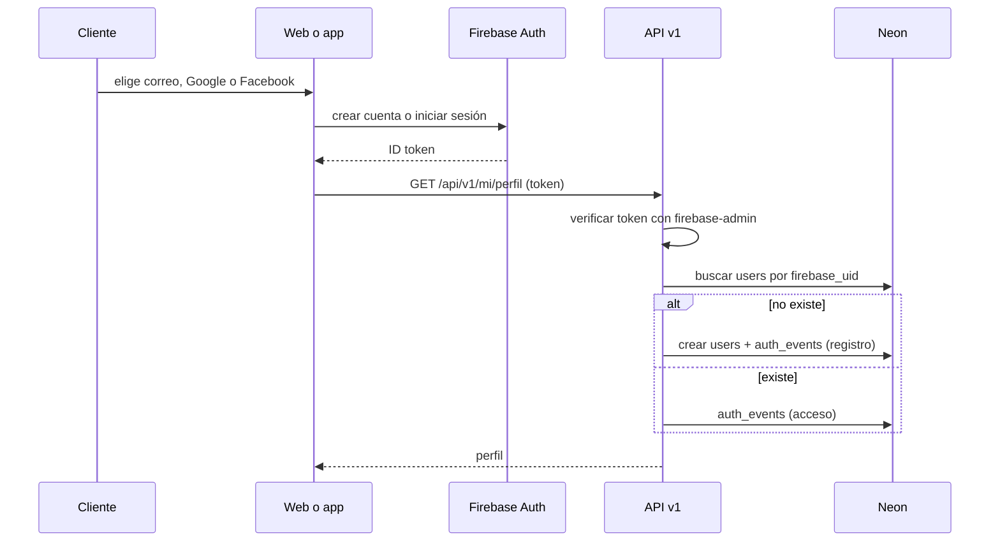

### 8.2 Vinculación de proveedores, para evitar cuentas duplicadas

El proyecto de Firebase se configura con **una sola cuenta por dirección de correo**. Sin
esa opción, la misma persona acabaría con tres cuentas y tres filas en `users`.

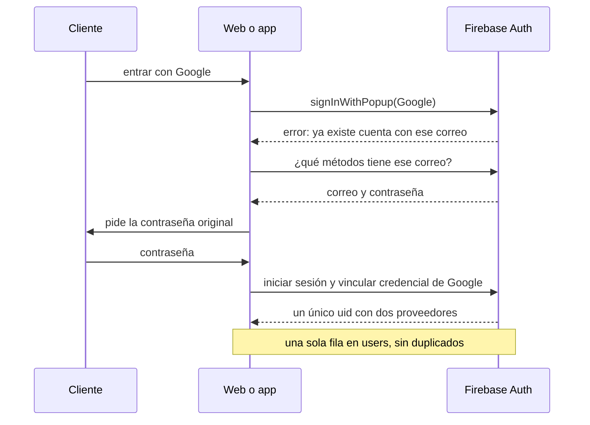

### 8.3 Carrito local fusionado al iniciar sesión

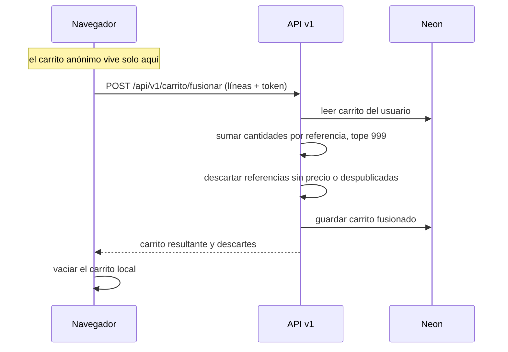

### 8.4 Checkout con acceso obligatorio

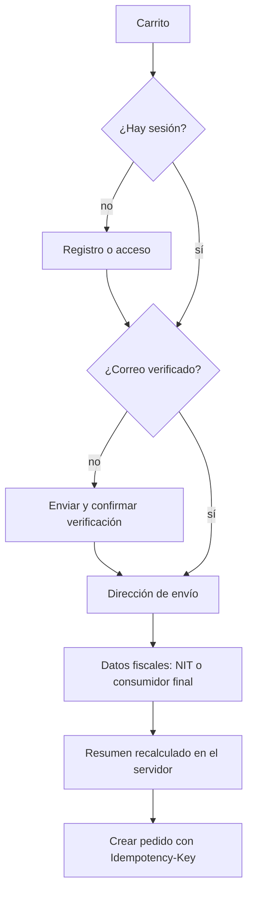

### 8.5 Confirmación del pedido con el proveedor

Sustituye al flujo de reserva de inventario del encargo original, que ya no aplica porque
la empresa no maneja existencias.

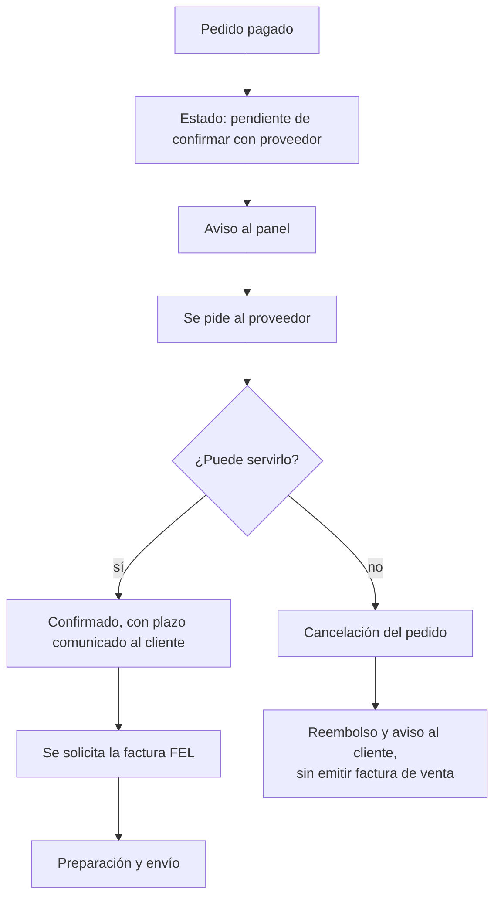

**Este es el único punto donde nace la factura.** El pago confirmado no la dispara: deja
el pedido pendiente de confirmación del proveedor. Solo la confirmación del proveedor la
solicita, y una cancelación no emite ninguna factura de venta.

### 8.6 Creación idempotente del pedido

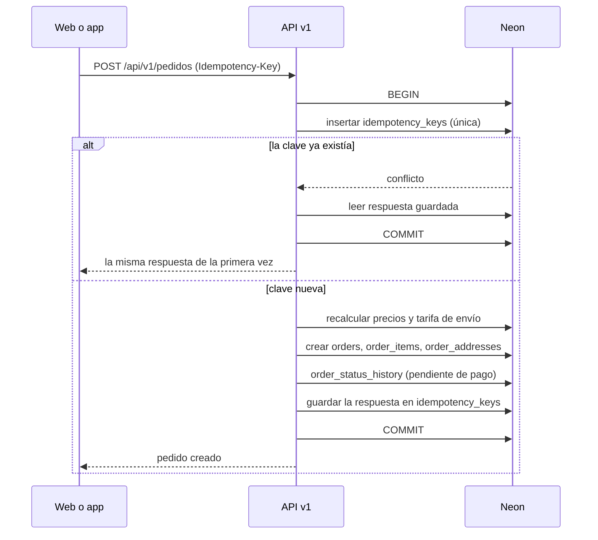

### 8.7 Pago y webhook firmado

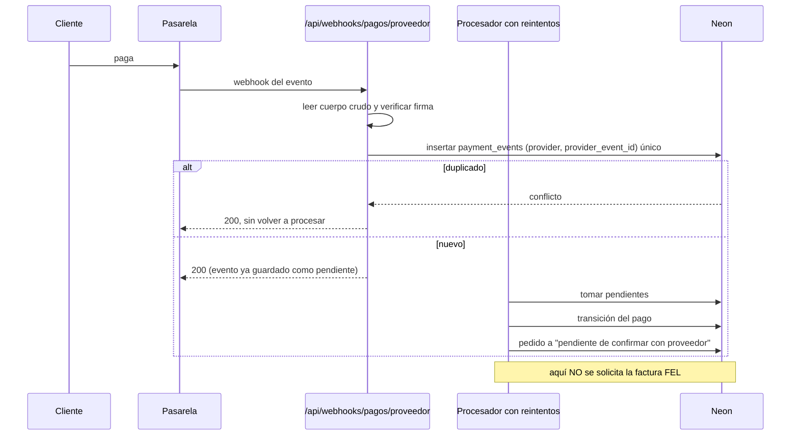

**El webhook de pago no dispara la factura.** Un pago confirmado deja el pedido
**pendiente de confirmación del proveedor**, y la factura FEL se solicita únicamente
cuando el proveedor ha confirmado que puede servirlo (sección 8.8). Si no puede, el pedido
se cancela y se reembolsa **sin emitir factura de venta**.

**Criterio de idempotencia correcto:** un webhook no crea el cobro, comunica uno ocurrido
en el proveedor. Recibir diez veces el mismo webhook debe producir **un único evento
registrado, una única transición del pago y una única actualización del pedido**. Y, en el
punto en que sí corresponde emitirla, **una única solicitud de factura FEL**.

### 8.8 Emisión de la factura FEL

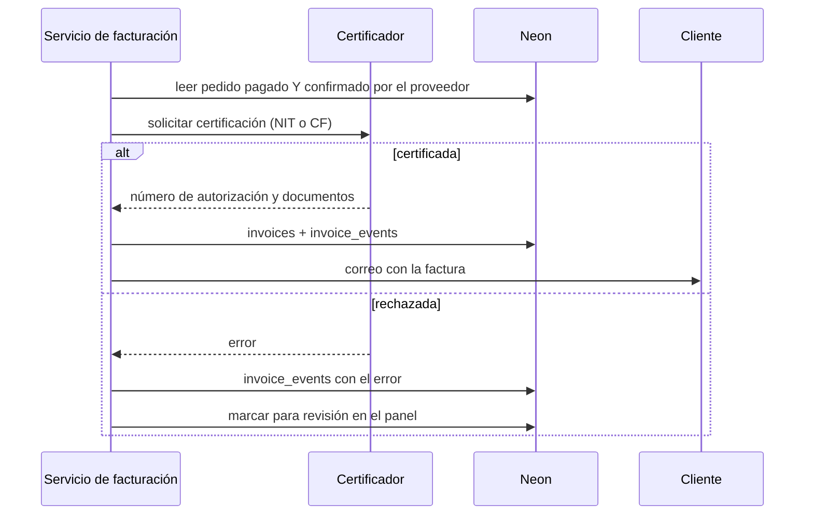

### 8.9 Preparación y seguimiento del envío

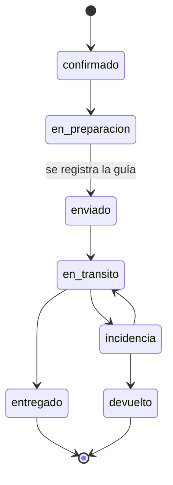

### 8.10 Pago rechazado, caducado o reembolsado

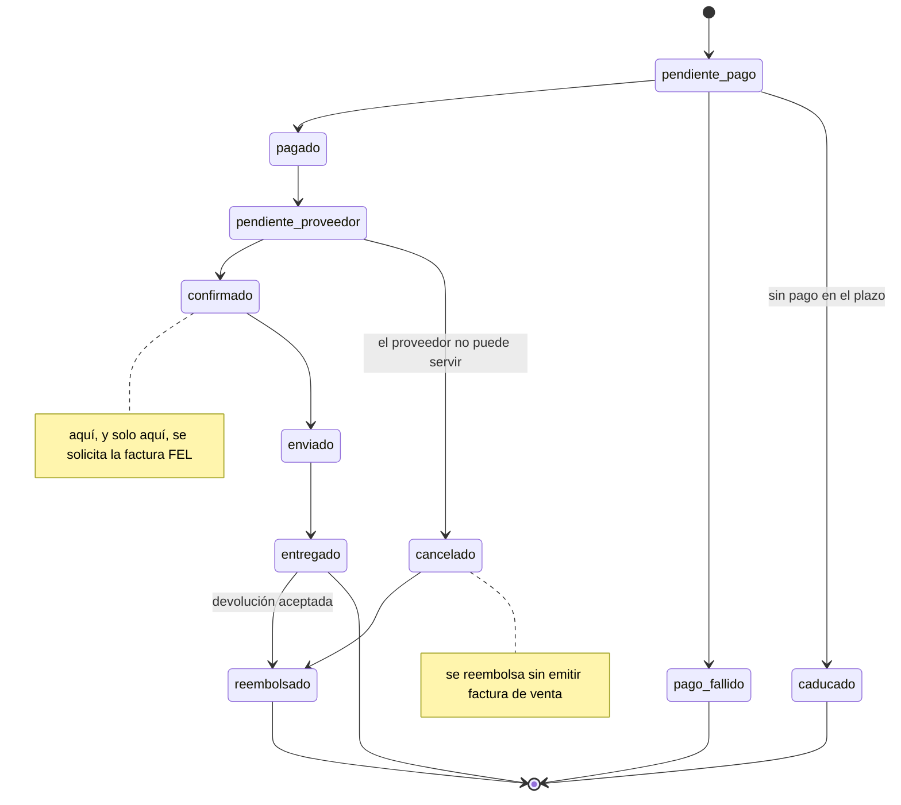

---

## 9. Pruebas y transición

### 9.1 Entornos

Cuatro, apoyados en que Neon permite ramificar la base:

| Entorno | Base |
|---|---|
| Desarrollo | Rama propia de Neon |
| Pruebas | Rama efímera que nace y muere con cada ejecución de la batería |
| Staging | Rama estable más el preview de Vercel |
| Producción | La rama principal |

Los datos de prueba se generan; **ninguna persona real aparece en ellos**.

### 9.2 Migraciones

**El migrador ya se comporta así hoy**, comprobado el 30/08/2026: `scripts/migrate.mjs`
aplica cada archivo dentro de `begin` / `commit`, hace `rollback` deshaciendo el archivo
entero si una instrucción falla, e inserta la fila de `schema_migrations` dentro de la
misma transacción. Es además repetible.

Lo que falta no es construirlo, sino **verificarlo, cubrirlo con pruebas y reforzarlo si
la comprobación revela huecos** —por ejemplo, si conviene tomar un bloqueo consultivo para
que dos ejecuciones simultáneas no compitan—. Esa es la tarea del subproyecto 1, y no debe
presentarse como si el comportamiento transaccional fuera nuevo.

### 9.3 Niveles de prueba

| Prueba | Qué demuestra |
|---|---|
| Unidad | Cálculo en centavos, resolución del precio vigente, transiciones de estado válidas |
| Integración con base real aislada | Que transacciones, restricciones y permisos hacen lo que dicen |
| Autenticación y autorización | Que un cliente no ve pedidos de otro y un empleado no cambia precios |
| Permisos de PostgreSQL | La lista de tablas prohibidas, una por una, comprobando además `current_user` |
| Privacidad del proveedor | La prueba actual sobre los *chunks* compilados, que se conserva |
| Idempotencia de webhooks | Diez recepciones del mismo evento: un evento, una transición, una actualización, una factura |
| Idempotencia de peticiones | El mismo `Idempotency-Key`: un solo pedido |
| Paridad de los 313 productos | Que el modelo nuevo devuelve exactamente lo mismo que el viejo |
| Concurrencia | Dos peticiones simultáneas creando el mismo pedido producen uno |
| Carga y coste | Que el catálogo aguanta y cuánto cuesta |

**No hay prueba de concurrencia sobre la última unidad**: ya no existe tal cosa.

### 9.4 Transición

- **Lectura en paralelo:** durante un tiempo el catálogo se lee del modelo viejo y del
  nuevo a la vez, se comparan los resultados y **se registran las diferencias sin cambiar
  lo que ve el visitante**. El modelo nuevo se estrena habiéndose demostrado idéntico con
  tráfico real.
- **Bandera de transición en `app_settings`**, no en una variable de entorno. Cambiar una
  variable en Vercel exige normalmente un nuevo despliegue o una nueva ejecución aunque
  el código no cambie, así que no sirve como vuelta atrás inmediata. `app_settings` es
  configuración persistente y protegida, con valores `legacy`, `shadow` y
  `relational_v2`, caché breve y auditoría de quién la cambió.
- **Calendario de esa bandera, aprobado el 30/08/2026.** Al terminar el subproyecto 1
  queda en **`legacy`**. **`shadow`** se usa solo para comparar y registrar diferencias.
  **`relational_v2` no se activa en el subproyecto 1 en ningún caso**: solo podrá
  activarse en el subproyecto 3, con el catálogo relacional ya existente, todas las
  pruebas de paridad y privacidad en verde y **autorización expresa del dueño**.
- **Ninguna migración destructiva mientras se prueba.** El modelo viejo se conserva
  entero. Retirarlo es el subproyecto 11 y necesita autorización expresa.
- **Medición de coste** antes y después: cómputo y almacenamiento de Neon, usuarios
  activos de Firebase, Blob y Vercel.

---

## 10. División en subproyectos

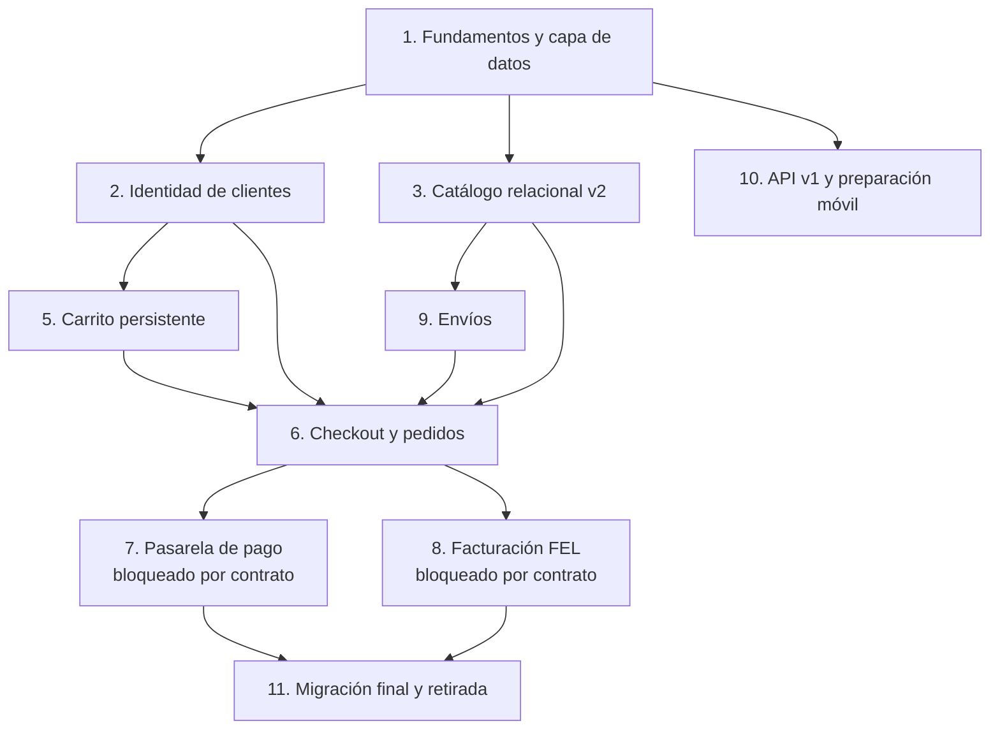

| # | Subproyecto | Contenido | Estado |
|---|---|---|---|
| 1 | Fundamentos y capa de datos | Capa única de acceso, transacciones, errores tipados, registro, verificación del migrador, proyección pública y rol público, `app_settings`, `audit_log` | Listo para empezar |
| 2 | Identidad de clientes | Firebase Auth, `users`, direcciones, consentimientos, eventos, borrado y anonimización | Tras 1 |
| 3 | Catálogo relacional v2 | Categorías jerárquicas, características normalizadas, imágenes, precios con vigencia | Tras 1 |
| 5 | Carrito persistente | `carts`, `cart_items`, fusión al iniciar sesión | Tras 2 |
| 9 | Envíos | Zonas, tarifas, envíos y seguimiento | Tras 3 |
| 6 | Checkout y pedidos | Pedidos, líneas con instantánea, direcciones, historial, idempotencia, datos fiscales | Tras 2, 3, 5 y 9 |
| 7 | Pasarela de pago | Pagos, eventos, reembolsos, webhook firmado y duradero | **Bloqueado**: falta contratar |
| 8 | Facturación FEL | Facturas, eventos, emisión desde el servidor | **Bloqueado**: falta contratar |
| 10 | API v1 y preparación móvil | Contratos, cursor, límites, versionado, App Check | Se formaliza tras 1 |
| 11 | Migración final | Retirar `stock` y su carrito, retirar `app/data/products.ts`, apagar el modelo antiguo | Al final |

**El número 4 no existe**: era inventario y reservas, y desapareció con la decisión 3.

Cada subproyecto lleva su especificación, su plan, sus pruebas, sus criterios de
aceptación, commits pequeños y un punto de revisión con el dueño antes de continuar.

### Por qué Fundamentos va primero

El argumento decisivo es de coste, no de orden. **Hoy hay once sitios que abren su propia
conexión a Neon.** Cada subproyecto añade más: si Fundamentos va el último, los once se
habrán convertido en treinta y unificarlos dejará de ser un trabajo de semanas para ser
uno de meses, con riesgo de romper una tienda ya en marcha. Es la única pieza que se
abarata haciéndola primero.

Los otros tres motivos:

1. **Sin transacciones en la aplicación no se puede crear un pedido de forma atómica.**
   Conviene precisar qué es lo atómico y qué no: dentro de una transacción de Neon pueden
   ir el pedido, sus líneas, sus direcciones, su registro de estado, el **registro local
   del intento de pago** y la clave de idempotencia. **El cobro en sí no**: lo ejecuta una
   pasarela externa y no puede formar parte de una transacción de base de datos. El
   resultado real del cobro lo confirma después el webhook firmado.
2. La regla de centavos enteros y la del aislamiento del proveedor pasan de convenciones
   a restricciones que el sistema impone.
3. La estrategia de ramas de Neon, que todos los demás subproyectos necesitan, nace aquí.

**La pega honesta:** Fundamentos no aporta nada visible. Su criterio de éxito es la
paridad total, y esa invisibilidad es precisamente lo que lo hace seguro.

---

## 11. Riesgos y decisiones pendientes

### Riesgos

| Riesgo | Mitigación |
|---|---|
| La ventana entre el cobro y la confirmación del proveedor genera reembolsos con comisión | Estado explícito, aviso al cliente por correo y medición de cuántos ocurren |
| El plazo de entrega prometido depende de terceros | Se comunica como estimación, editable, y se confirma al confirmar con el proveedor |
| Reclasificar 313 productos en categorías y ambientes es trabajo manual del dueño | Siembra automática desde la aplicación actual, con revisión posterior |
| Interpretar 12 características desde texto libre puede fallar | Migración con informe de casos dudosos para revisión manual |
| El pool sobre WebSocket es nuevo en el proyecto | Criterio de aceptación dedicado a que no queden clientes prestados |
| Dos sistemas de identidad conviviendo (panel y clientes) | Frontera clara: el panel no toca Firebase y los clientes no tocan `admin_users` |
| Facebook exige verificación de empresa de Meta | Se lanza con correo y Google; Facebook se añade después sin cambiar el modelo |
| La proyección pública `public_products` puede desincronizarse y mostrar datos viejos | Se escribe en la misma operación que guarda el producto, con comando de reconstrucción total y comprobación de filas desincronizadas |
| El cliente paga y no recibe su factura de inmediato, porque espera a la confirmación del proveedor | Se le explica en la confirmación de compra qué recibirá y cuándo; emitir antes obligaría a anular facturas de pedidos que no se pueden servir |

### Decisiones pendientes

1. **Pasarela de pago:** sin contratar. Bloquea el subproyecto 7. Preguntas que hay que
   hacerle: entorno de pruebas, si el pago ocurre dentro de la web, cómo avisan del pago
   confirmado, comisión y plazo de depósito, **y si permite separar autorización y cobro**.
2. **Certificador FEL:** sin contratar. Bloquea el subproyecto 8.
3. **Política exacta de retención y anonimización:** se decide antes del subproyecto 2.
4. **Textos legales de venta en línea:** términos, privacidad, envíos y devoluciones
   específicas para compra en línea.
5. **Precios:** 25 de 313 cargados. Es la tarea más lenta del proyecto y no depende de
   nadie más.
6. **DNS de `econoluzgt.com`:** sigue apuntando al WordPress viejo.

---

## 12. Anexo: cierre de la sede de Quetzaltenango

**Esta sección no forma parte del rediseño del backend y no se deriva de él.** Es una
decisión de negocio que el dueño comunicó expresamente el 30/08/2026, en sus propias
palabras, al revisar la sección 1 de este diseño: que hay que quitar todo lo que tenga que
ver con la sucursal de Xela porque ya no va a estar, y que así se lo indicaron a él.

Queda registrada aquí solo para que no se pierda entre conversaciones. Es contenido, no
backend, y se ejecuta en una rama propia, aparte de este rediseño y con su autorización.
**Ninguna decisión técnica de este documento se justifica en ella.**

**Confirmación expresa del dueño (30/08/2026):** la sede de Quetzaltenango deja de existir
y ha pedido retirar del proyecto todo lo relacionado con ella.

**Alcance de la retirada:** la web, los textos, los datos, el SEO, la documentación y
cualquier referencia restante.

**Orden de ejecución, y es parte de la decisión:**

1. Primero se cierran y aprueban los dos documentos de diseño.
2. Después se actualiza la documentación (`CLAUDE.md` y `docs/CONTINUAR-PANEL.md`).
3. **Solo después**, y como **tarea propia y separada**, se eliminan el código y el
   contenido de Quetzaltenango, verificando que no quede ninguna referencia.

> **Esta confirmación no autoriza a mezclar esos cambios con el subproyecto 1.** Son dos
> trabajos distintos y no comparten rama.

Aparece hoy en siete lugares:

- `app/components/SiteFooter.tsx` (el bloque de la sede y su texto)
- `app/data/siteData.ts` (el texto de atención en dos ciudades)
- `app/page.tsx` (dos menciones)
- `CLAUDE.md` (la descripción de la empresa y la deuda técnica nº 7)

**La deuda técnica nº 7 de `CLAUDE.md` —«Xela está subrepresentado», que proponía
recuperar páginas locales para posicionar allí— queda derogada.** Volver a proponerla
sería trabajar en contra de una decisión de la empresa.

La decisión 5 (solo envío por mensajería) se tomó **antes** de conocerse este cierre y por
razones propias; no depende de él ni se apoya en él.

---

## 13. Historial

| Fecha | Cambio |
|---|---|
| 30/08/2026 | Documento inicial, aprobado por secciones con correcciones del dueño incorporadas: `firebase-admin` en lugar de `jose`, webhooks fuera de `/api/v1`, lista explícita de tablas prohibidas con prueba, `details` sin información interna, transacciones interactivas en runtime Node, borrado de cuenta que conserva la contabilidad, proyecciones públicas en lugar de tablas base, cola duradera de webhooks, criterio correcto de idempotencia y bandera de transición en `app_settings` |
| 30/08/2026 (cierre) | Las cuatro decisiones pendientes, aprobadas e incorporadas: la proyección pública entra en el subproyecto 1 pero como proyección derivada **de prueba**, sin sustituir al catálogo del visitante y con la frontera actual intacta; la bandera queda en `legacy` al terminar el subproyecto 1, `shadow` solo compara, y `relational_v2` únicamente en el subproyecto 3 con autorización expresa; la actualización de `CLAUDE.md` y `CONTINUAR-PANEL.md` es tarea documental separada, aprobada, posterior a estos documentos y anterior a implementar, y no autoriza a retirar nada de código; y el recuento de 33 tablas físicas, con `public_products` descrita como «tabla de proyección pública derivada y sincronizada» para no confundirla con una `MATERIALIZED VIEW`. Añadida la confirmación expresa del cierre de Quetzaltenango, su alcance y su orden de ejecución |
| 30/08/2026 (revisión del dueño) | Ocho correcciones tras su lectura completa: recuento exacto de tablas (33, desglosado en 31 de negocio, `app_settings` y la proyección derivada); auditoría corregida porque **el migrador ya es transaccional**; la factura FEL se solicita solo tras la confirmación del proveedor, no al confirmarse el pago; precisión de qué es atómico en la creación del pedido y qué no (el cobro externo nunca lo es); **la proyección pública pasa de vista a tabla materializada** porque la limpieza de privacidad usa los datos del proveedor como contexto; la regla de importación del controlador se limita a `app/**` y excluye `scripts/**`; se explicita que este diseño sustituye reglas vigentes de `CLAUDE.md` y `CONTINUAR-PANEL.md`, que se actualizarán aparte; y el cierre de Quetzaltenango pasa a anexo, sin presentarse como consecuencia técnica |
