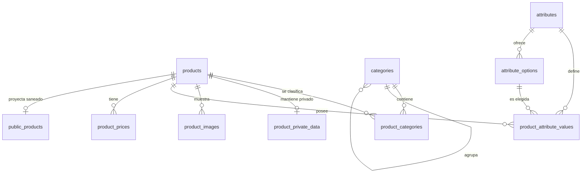

# Núcleo relacional de productos y catálogo de la tienda — diseño aprobado

**Estado:** aprobado por el dueño el 02/09/2026. Pendiente de revisión del documento antes
de reescribir o continuar el plan de implementación.

**Ámbito:** subproyecto 3. Este diseño define el núcleo de productos que necesita la tienda;
no pretende implementar todavía pedidos, pagos, inventario, facturación ni un ERP.

## 1. Objetivo y límites

El modelo nuevo se construye en paralelo al catálogo actual. No se borra ni sustituye la
fuente antigua durante este subproyecto. Primero se crea y prueba el esquema, después se
importan los datos en una rama de Neon de desarrollo autorizada, luego se compara en
`shadow` y solo se activa `relational_v2` con autorización expresa y paridad demostrada.
La retirada del modelo antiguo pertenece al subproyecto 11 y exige otra autorización.

No hay ninguna relación entre categorías y atributos. Una categoría clasifica productos;
una característica describe el producto concreto que la posee.

## 2. Modelo aprobado

El núcleo conserva inicialmente `products` como fuente antigua y añade ocho tablas:

1. `categories`
2. `product_categories`
3. `product_private_data`
4. `product_images`
5. `attributes`
6. `attribute_options`
7. `product_attribute_values`
8. `product_prices`

`public_products` ya existe como proyección pública derivada y saneada. No es una novena
tabla del subproyecto ni una fuente de verdad.

## 3. Responsabilidad y reglas de cada tabla

### 3.1 `products`

Durante la transición sigue siendo el modelo antiguo. Al retirar el legado quedará como el
núcleo del producto: identidad, nombre, referencia pública, estado, descripción y la ficha
larga que todavía no compense normalizar en `technical_specs`. No contiene precios,
imágenes, categorías, valores de atributos ni datos privados del proveedor.

### 3.2 `categories`

Guarda el árbol de navegación mediante `parent_id`, además de nombre, `slug` único,
posición, estado publicado y marcas de tiempo. Su única función es clasificar y organizar
productos. No determina qué atributos puede tener un producto.

### 3.3 `product_categories`

Resuelve la relación muchos-a-muchos entre productos y categorías e identifica una
categoría principal. La pareja `(product_id, category_id)` es única. Un índice parcial no
único acelera la búsqueda y un *constraint trigger* inicialmente diferido exige exactamente
una principal cuando el producto tenga al menos una categoría. El trigger serializa por
producto antes de contar, para que dos escrituras concurrentes no validen cada una una
principal distinta. Así se pueden reemplazar asignaciones dentro de una sola transacción
sin rechazar estados intermedios.

### 3.4 `product_private_data`

Es una relación uno-a-cero-o-uno y contiene exclusivamente los siete datos privados que hoy
proceden del proveedor: `supplier_brand`, `supplier_brand_label`, `supplier_series`,
`supplier_series_label`, `supplier_code`, `supplier_name` y `supplier_description`.

`supplier_code` es el código que ECONOLUZ usa internamente para vender. Es editable y
buscable en el panel, nunca público y no es `UNIQUE`, porque algunos registros actuales
contienen varios códigos separados por `/`. `sku` y `productCode` son alias actuales de ese
mismo dato: no se crean columnas duplicadas. Cuando se implemente la venta, cada línea del
pedido copiará el `supplier_code` utilizado para que el histórico no cambie si se edita el
producto. Separar variantes o códigos individuales queda fuera de este subproyecto y se
decidirá al diseñar el ERP.

### 3.5 `product_images`

Guarda varias imágenes por producto, con URL o ruta, texto alternativo, posición,
visibilidad y marca de principal. La pareja `(product_id, position)` es única mediante una
restricción inicialmente diferida, para poder intercambiar dos posiciones en un solo
`UPDATE`, y un índice parcial impide dos imágenes principales. La FK usa `ON DELETE
RESTRICT`: la retirada desde el panel es reversible y borrar la referencia no eliminaría el
archivo local o de Blob. La operación de publicación valida que un producto publicado tenga
una imagen principal visible.

### 3.6 `attributes`

Define características reutilizables mediante una clave estable y única, nombre visible,
tipo (`numero`, `texto`, `booleano`, `opcion` u `opcion_multiple`), unidad opcional,
`filterable`, `comparable`, `active` y marcas de tiempo.

Desde el panel se pueden crear atributos y editar su nombre, unidad y flags. Si un atributo
no tiene valores puede borrarse; desde que está usado solo puede desactivarse. El tipo de un
atributo usado es inmutable para no reinterpretar datos existentes. Su clave continúa
reservada aunque se desactive.

**No existe `category_attributes`.** Al editar un producto, el administrador elige los
atributos que ese producto necesita, independientemente de sus categorías.

### 3.7 `attribute_options`

Guarda las opciones de los atributos `opcion` y `opcion_multiple`, con clave estable,
etiqueta, posición, `active` y marcas de tiempo. Una opción debe ser única dentro de su
atributo. Puede borrarse si nunca se ha usado; si ya está referenciada solo se desactiva.
Desactivar impide nuevas asignaciones, pero conserva los productos históricos.

### 3.8 `product_attribute_values`

Es la unión entre producto y característica y guarda el valor real en una de cuatro
columnas tipadas: `value_number`, `value_text`, `value_bool` u `option_id`. Una restricción
`CHECK` exige exactamente una columna no nula.

La escritura transaccional o un *constraint trigger* diferible comprueba además que:

- la columna usada coincide con el tipo del atributo;
- `option_id` pertenece a ese mismo atributo y está activa para nuevas asignaciones;
- `numero`, `texto`, `booleano` y `opcion` tienen como máximo un valor por producto y
  atributo;
- `opcion_multiple` admite varias filas, pero nunca la misma opción dos veces.

Los índices `(attribute_id, value_number)` y `(attribute_id, option_id)` permiten filtros
numéricos por rango y filtros por opción sin interpretar cadenas. Por ejemplo, una lámpara
puede guardar potencia `20` en `value_number`, con la unidad `W` definida en `attributes`;
el valor real es `20`, no el texto `"20 W"`.

### 3.9 `product_prices`

Guarda importes en centavos enteros, tipo `normal` o `promocion` y periodo de vigencia con
`tstzrange`. Una restricción de exclusión impide promociones solapadas para el mismo
producto. La lectura obtiene el precio normal vigente y, si existe, la única promoción
vigente. Al crear un precio normal nuevo, el contrato de escritura de la Fase B cierra el
límite superior de la vigencia del normal anterior e inserta el nuevo dentro de la misma
transacción: nunca quedan dos normales vigentes por un guardado parcial. El inventario no
forma parte de esta tabla ni de este subproyecto.

### 3.10 `public_products`

Es la proyección derivada que consume el visitante. Contiene solo datos públicos ya
saneados y nunca expone `product_private_data`. Se reconstruye dentro del contrato de
escritura del producto; no se edita directamente y no sustituye a las tablas relacionales
como fuente de verdad.

## 4. Escritura atómica desde el panel

Guardar un producto abre una transacción y, en este orden lógico:

1. valida el cuerpo completo, los tipos y las autorizaciones;
2. inserta o actualiza el núcleo de `products`;
3. sincroniza datos privados, categorías, imágenes, valores de atributos y precios; si se
   crea un precio normal, cierra antes la vigencia del normal anterior dentro de esta misma
   transacción;
4. comprueba principal de categoría e imagen, tipos, opciones y periodos de precios;
5. reconstruye la fila saneada de `public_products`;
6. registra la auditoría;
7. confirma la transacción y después invalida la caché.

Si cualquier regla falla, toda la transacción se revierte. Nunca se deja el producto a
medias ni se publica una proyección que no corresponda a la fuente de verdad.

Crear, borrar o desactivar definiciones de atributos y opciones usa también operaciones del
servidor con autorización de administrador. El navegador no escribe directamente en estas
tablas.

## 5. Lectura y transición

- `legacy`: sirve únicamente el catálogo actual.
- `shadow`: sigue sirviendo `legacy`, pero lee también el modelo nuevo y registra diferencias
  de forma segura.
- `relational_v2`: sirve el modelo nuevo; solo se habilita con autorización expresa.

La secuencia de migración es aditiva:

1. **Fase A:** corregir esquema y lógica pura, sin aplicar migraciones.
2. **Fase B:** con autorización, aplicar en una rama de Neon de desarrollo e importar todos
   los productos de forma idempotente. Antes de aplicar `010`, comprobar que `btree_gist`
   está disponible y que el rol migrador tiene `CREATE` sobre la base para instalar esta
   extensión confiable si aún no existe.
3. **Fase C:** con autorización, ejecutar `shadow` hasta lograr paridad de datos, precios,
   atributos, categorías, imágenes y privacidad.
4. **Fase D:** con autorización expresa, activar `relational_v2` con reversión inmediata a
   `legacy` disponible.
5. **Subproyecto 11:** tras un periodo estable y otra autorización, retirar el legado.

La migración nunca borra la base antigua como condición para probar la nueva. La retirada
solo ocurre después de que todo haya superado las pruebas y el dueño la apruebe.

## 6. Verificación exigida

- Migración repetible y transaccional en una base vacía y en una rama de desarrollo.
- Confirmación previa de que `btree_gist` está disponible o se puede crear con el rol
  migrador de la rama aislada.
- Pruebas de cada restricción positiva y negativa: principal única y obligatoria, opciones
  del atributo correcto, tipos, valores escalares, opciones múltiples y promociones.
- Pruebas de creación, edición, borrado de no usados y desactivación de usados desde el
  contrato del panel.
- Importación idempotente de los 313 productos y comparación campo a campo.
- Confirmación de que `supplier_code` es buscable en administración y nunca público.
- `test:datos`, `test:admin`, `test:proveedores`, permisos, `typecheck`, `lint`, `build` y
  Playwright en verde antes de solicitar cada cambio de fase.
- Prueba de reversión de `shadow` y `relational_v2` a `legacy`.

## 7. Fuera de alcance

Quedan fuera los pedidos, pagos, envíos, FEL, inventario, variantes de ERP, textos legales,
consentimientos y la destrucción del modelo antiguo. Este diseño prepara el producto de una
tienda, pero no adelanta decisiones de esos subproyectos.
